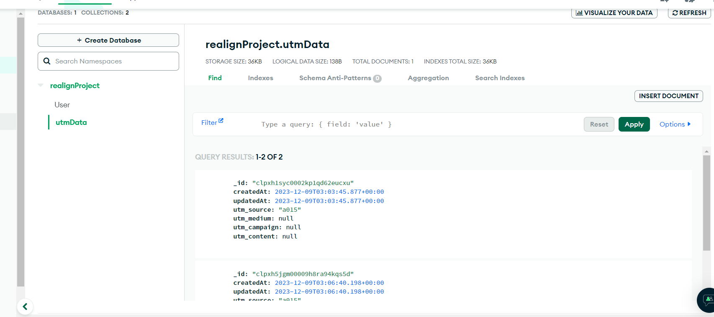
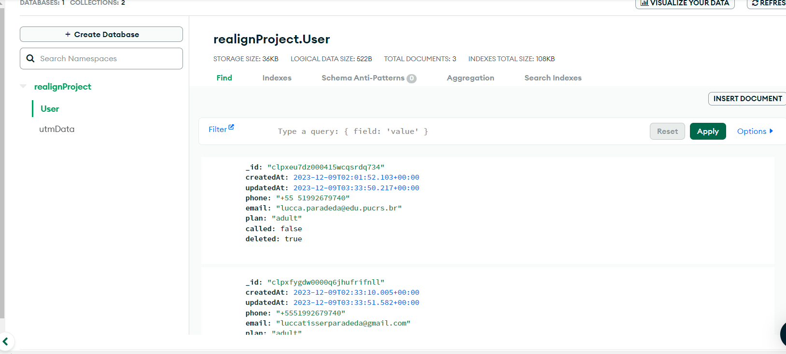

# Realign Project

**Project description:**

I was challenged to deploy a simple project with the following functionalities, all to be completed within exactly 6 counted hours:

- Creation of a page for selling a product, allowing clients to input their phone number and email.
- Development of a data visualizer for the sales team, facilitating client communication.
- Implementation of UTM data to inform the marketing team about the performance of campaigns.
- Integration of analytics tools to track user interactions and glean insights for optimization.
- Adoption of a tech stack with which I wasn't previously familiar.

---

**To-dos:**

- [x] Backend - Database Schema - Database - 1h
- [x] Data visualizer for the sales team - 1h
- [x] GTM - simple tags - 30min
- [x] HTML CSS table to compare projects and submit your phone number (with input masks and validation) - 2h
- [x] UTM data - 30min
- [x] Finishing touches

---

**Time Log:**

2:10h - designed and created backend with a no SQL database, and the data visualizer for the sales team.

2:12h - updated database schema to also have email unique attr.

2:52h - creating the html table and styling it

3:39h - styling the view from the products page, then will begin the form styling and functionality

4:09h - finished all products page style, adding product to backend

4:19h - finished all styles on product page, making some adjustment to be fully responsive and correcting some little bugs on backend

4:29h - creating GTM account

5:00h - setting up dummy tags

5:30h - finished dummy tags and UTM data

6:00h - final review, added toast and some other messages

---

## Things I would improve

- Make the table in the frontend-sales overflow scroll even in desktop ( medium / small devices )
- use zod or some other validator in the backend
- use regExp to validate the user input in the products frontend
- in the frontend-sales create listing and sorting for the table and also a company login.
  - Error messages
- use more real GTM tags

---

## Database

I chose MongoDB as the database because it was easy and fast to set up without having to start a Docker container every time I needed to make small adjustments.

---

## Deployments

I managed to deploy both frontends to Vercel because it's a quick and easy platform that I could set up without wasting much time.

I didn't deploy the backend to AWS Lambda because I didn't want to waste valuable time on that.

---

## Tech Stack

For the products front-end I chose to got with a simple HTML CSS JS web page because in the document gave to me It was written that this part of the challenge was to test my HTML and CSS skills.

For the sales front-end I chose to go with VUE because that`s the stack that Realign uses.

For the back-end, serverless framework with Nodejs and Prisma.
